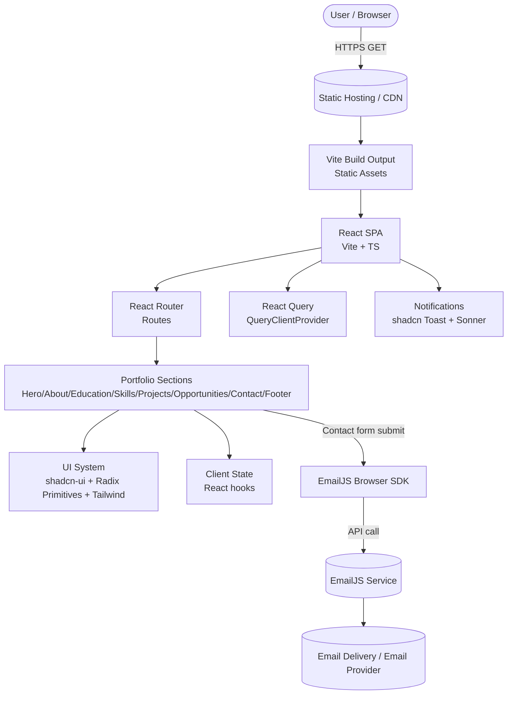
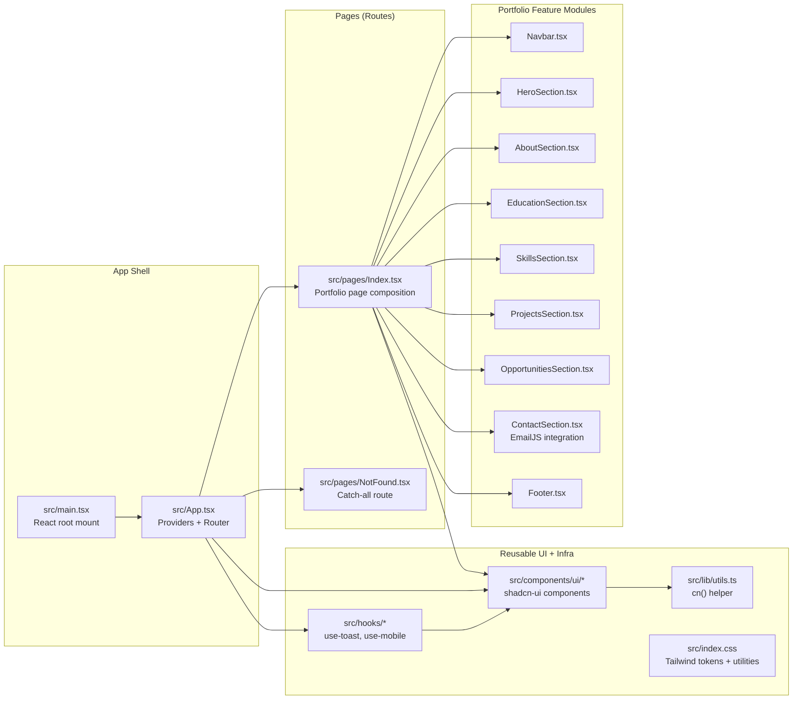

# Chapter 1: Introduction

## 1.1 Project overview
This project is a **single-page portfolio web application** built as a client-rendered **React (18) + TypeScript** application and bundled with **Vite**. The application’s primary objective is to present a modern, responsive, visually consistent personal portfolio containing:

- A hero landing section (identity, primary call-to-actions, external profile links)
- “About me” section (summary and traits)
- Education timeline
- Skills breakdown (core skills with progress bars + developing skills cards + tools row)
- Projects listing (selected projects with tags, highlights, and tech chips)
- Opportunities section (interest areas and collaboration CTA)
- Contact section with a working email form (EmailJS integration)
- Footer with social links and attribution

The codebase follows a **composition-first UI architecture** typical for React SPAs: the home route renders a page component (`Index`) that composes a set of section components. Styling is implemented using **Tailwind CSS** and a token-based design system (CSS variables). UI building blocks come from **shadcn-ui** components that wrap **Radix UI** primitives.

## 1.2 Scope and goals
### Functional scope
- **Portfolio content rendering**: sections are static data + JSX composition, optimized for readability and design.
- **Navigation**: sticky navbar with anchor links (hash-based scroll targets).
- **Contact workflow**: a form triggers a client-side email send via EmailJS, with loading, success, and error UI.
- **Routing**: browser-based routing for root (`/`) and a catch-all “Not Found”.

### Non-functional goals
- **Fast iteration**: Vite dev server; strictness deliberately relaxed in TypeScript config to reduce friction.
- **Design consistency**: shared tokens, utility classes, and consistent spacing/typography.
- **Deployable artifact**: output is a static bundle suitable for hosting on any static host/CDN.

## 1.3 Target users and usage context
- **Primary users**: recruiters, hiring managers, peers, collaborators.
- **Typical flows**:
  - Skim hero → explore projects → contact via the form or external links.
  - Quick access to LinkedIn/GitHub/email via hero/footer icons.
  - Mobile browsing (responsive layout + mobile nav drawer).

## 1.4 What the project is (and is not)
- **Is**: a frontend-only SPA with client-side contact submission through a third-party email service.
- **Is not**: a backend API, database-driven application, or multi-tenant platform.

## 1.5 Repository highlights (high-signal entrypoints)
- **App bootstrap**: `src/main.tsx`
- **Providers + router**: `src/App.tsx`
- **Home page composition**: `src/pages/Index.tsx`
- **Feature sections**: `src/components/portfolio/*`
- **Contact integration**: `src/components/portfolio/ContactSection.tsx`
- **Styling tokens/utilities**: `src/index.css`
- **Build configuration**: `vite.config.ts`, `tailwind.config.ts`, `postcss.config.js`, `tsconfig*.json`, `eslint.config.js`

## 1.6 Constraints and assumptions
This application assumes:
- The browser supports modern ES2020+ features (targeted by the build).
- The EmailJS configuration (service/template/public key) is valid and active.
- Hosting provides standard static-file serving (no special server-side rendering required).

---

# Chapter 2: Tools, Technologies, and Cloud Services Used

## 2.1 Language and runtime
- **TypeScript**: primary language; compilation/transpilation handled by Vite build pipeline.
- **JavaScript (ESM)**: project uses `"type": "module"` and Vite’s ESM-first workflow.
- **Browser runtime**: client-side rendering (CSR) only.

## 2.2 Framework and core libraries
- **React 18**: component model, hooks, render pipeline.
- **React Router DOM (v6)**: SPA routing (`BrowserRouter`, `Routes`, `Route`).
- **@tanstack/react-query**: application-level data orchestration pattern via `QueryClientProvider`.
  - In this specific project, React Query is set up as infrastructure in `App.tsx`; even if the current sections are mostly static, the provider enables scalable addition of API-driven content later (e.g., dynamic projects list, blog posts, GitHub stats).

## 2.3 UI and design system
- **Tailwind CSS**: utility-first styling.
- **tailwindcss-animate**: standardized animation utilities.
- **shadcn-ui component set**: local UI components under `src/components/ui/*`.
- **Radix UI primitives**: accessible base components used by shadcn-ui (accordion, dialog, dropdown, etc.).
- **Lucide React**: icon set used across the portfolio sections.

### Token model (CSS variables)
The theme relies heavily on CSS variables (HSL-based), defined under `:root` in `src/index.css`:
- Semantic tokens: `--background`, `--foreground`, `--border`, `--muted`, etc.
- Brand tokens: `--cyan`, `--cyan-glow`, `--cyan-dim`
- Surface elevation tokens: `--dark-surface`, `--dark-elevated`
These tokens are then consumed by Tailwind configuration so Tailwind color utilities map to the variable-driven design system.

## 2.4 Forms, validation, and user feedback
The current contact form uses:
- **React state** (`useState`) for form data management and UI state (loading/submitted/error).
- **EmailJS Browser SDK** (`@emailjs/browser`) for sending email without a backend.

For user feedback:
- **Toaster** (shadcn toast implementation)
- **Sonner** notifications integrated with theme awareness (`src/components/ui/sonner.tsx`).

## 2.5 Build tooling and developer experience
- **Vite**: dev server + build.
  - Dev server configured to run on **port 8080** and host on IPv6 `::`.
  - React integration uses **SWC** for fast TS/JSX transforms (`@vitejs/plugin-react-swc`).
- **ESLint**: linting across TS/TSX.
- **Vitest** + **Testing Library**: test runner and DOM assertions (present in dependencies; a starter test exists).

## 2.6 Cloud services / external services
Even though the app is static-host friendly, it uses one key external service:

### EmailJS (third-party email sending)
The contact form submits directly to EmailJS:
- **Service**: EmailJS (hosted platform)
- **Integration**: client SDK call `emailjs.send(...)`
- **Implication**: no backend required, but public keys are embedded in client code.

### Static hosting/CDN (deployment target)
The repo README references deployment via Lovable’s publish flow. Architecturally, the output artifact is static and can be hosted on:
- Any static host (e.g., object storage + CDN)
- Traditional web server (Nginx/Apache)
- Platform hosts (Netlify/Vercel/Cloudflare Pages/GitHub Pages), as long as SPA routing is configured (for React Router fallback).

---

# Chapter 3: System Architecture and Module Design
(Includes Architecture Diagram & Module Diagram)

## 3.1 Architectural style
The system is a **client-side SPA** with:
- **Static content modules** (most sections)
- **One external service integration** (EmailJS)
- **Reusable UI layer** (shadcn-ui + Tailwind + tokens)
- **Cross-cutting providers** (React Query, tooltip provider, toaster systems)

This yields a classic 3-layer frontend architecture:
- **Presentation layer**: portfolio sections and pages
- **UI component layer**: reusable components in `src/components/ui`
- **Integration layer**: external service calls (EmailJS) + infrastructure providers

## 3.2 Data flow (high-level)
Most content is local/static (arrays in components). The only interactive “write” path is the contact form:
- User enters form values → component state updated
- On submit → SDK call to EmailJS
- On success/failure → UI state toggled and status shown to user

## 3.3 Architecture diagram
Standalone file in root: `Architecture_Diagram.mmd`

## 3.4 Module diagram (component decomposition)
Standalone file in root: `Module_Diagram.mmd`

## 3.5 Key modules and responsibilities
### `src/main.tsx` (bootstrap)
- Creates the React root and renders `App`.
- Imports `index.css` to activate Tailwind base + tokens + utilities.

### `src/App.tsx` (composition root)
Defines cross-cutting providers and routing:
- React Query: `QueryClientProvider`
- Tooltip context: `TooltipProvider`
- Notifications: shadcn `Toaster` + Sonner `Toaster`
- SPA routing: `BrowserRouter` + two routes (`/` and `*`)

### `src/pages/Index.tsx` (page composition)
Assembles the portfolio sections in a fixed order. Each section uses an `id` so the navbar’s anchor links can scroll to targets.

### `src/components/portfolio/*` (feature sections)
Each file exports one default component that renders a section:
- `Navbar`: scroll-aware sticky nav + mobile menu
- `HeroSection`: identity + CTAs + external links
- `ContactSection`: controlled form + EmailJS submission
Other sections are primarily presentational with embedded static data arrays.

### `src/components/ui/*` (reusable UI atoms)
This is a local UI library generated/structured in the shadcn pattern. It standardizes accessible building blocks and integrates with Tailwind tokens and utility composition (`cn()`).

## 3.6 Cross-cutting concerns
- **Styling and design tokens**: centralized in `src/index.css` and tailwind config.
- **Accessibility**: improved by Radix primitives (focus management, ARIA patterns).
- **Performance**: minimal runtime complexity; build pipeline optimized via SWC.
- **Error surfaces**:
  - Contact send errors show a user-friendly message.
  - NotFound logs route access to `console.error`.

---

# Chapter 4: Implementation Details

## 4.1 Build configuration and runtime wiring
### Vite config (`vite.config.ts`)
Important settings:
- **Dev server**: port `8080`, host `::`
- **HMR overlay disabled**: avoids intrusive error overlays in development
- **Alias**: `@` → `./src` for cleaner imports
- **Lovable component tagger**: enabled in development mode

### TypeScript config (`tsconfig*.json`)
The app’s TS configuration is intentionally permissive:
- `strict` disabled in `tsconfig.app.json`
- `noImplicitAny` disabled
- `skipLibCheck` enabled
This reduces friction for rapid UI iteration but shifts some correctness burden to testing/linting and runtime behavior.

## 4.2 Routing and page structure
Routing is defined in `src/App.tsx`:
- `/` → `Index`
- `*` → `NotFound`

This is enough for:
- A single portfolio page
- A safe fallback route

If deployed on a static host, **SPA fallback** should be enabled so deep links resolve to `index.html`.

## 4.3 Section composition pattern
The `Index` page composes sections as direct children under `<main>`. Each section is a “feature component” with:
- A semantic `<section id="...">` wrapper
- A consistent spacing class (`section-padding`)
- Local, static data arrays (`projects`, `opportunities`, etc.)

This pattern is simple, but scales when augmented with:
- Data fetching (React Query) to populate sections
- Shared content model interfaces for typed content
- Feature-level lazy loading if/when sections become heavy

## 4.4 Styling implementation (tokens + Tailwind)
### Token definition
Tokens are defined using CSS variables in `src/index.css` (`:root` block). They are HSL triples, enabling easy alpha control via `hsl(var(--token) / alpha)`.

### Tailwind integration
`tailwind.config.ts` maps semantic colors to those tokens:
- `background`, `foreground`, `border`, `muted`, `card`, `popover`, etc.
- Custom palette entries: `cyan`, `surface`, `sidebar`

### Utilities and effects
`src/index.css` adds:
- Utility classes for cyan gradients and glow shadows
- A grid background pattern
- Global smooth scrolling
- Custom scrollbar styling
- Keyframe animations used by components (`float`, `pulse-glow`, `slide-up`, `fade-in`)

## 4.5 UI components (shadcn-ui pattern)
The `src/components/ui/*` directory includes prebuilt reusable components (accordion, dialog, dropdown, toast, tooltip, etc.). The pattern typically includes:
- A styled wrapper around Radix primitives
- Tailwind classes composed with `cn()` from `src/lib/utils.ts`
- Optional variants through class-variance-authority (CVA)

This local UI library:
- Improves consistency and reuse
- Keeps design tokens centralized
- Reduces repetitive UI wiring (e.g., accessibility props)

## 4.6 Contact form and EmailJS integration
### Controlled inputs
`ContactSection` stores form data in a state object:
- `name`, `email`, `subject`, `message`

### Submission lifecycle
On submit:
- Disable submit button via `loading`
- Clear previous error
- Call `emailjs.send(serviceId, templateId, variables, publicKey)`
- On success: show “Message Sent” UI and reset form
- On failure: show user-facing error message

### Security and operational considerations
Because this is a frontend-only integration:
- EmailJS public key is embedded in the bundle.
- Service/template IDs are visible to end-users.

Mitigations commonly used in production:
- Restrict EmailJS templates to allow only expected variables and formats.
- Configure domain restrictions (where supported by the service).
- Implement rate limiting or CAPTCHA in the form flow (requires additional tooling).
- Prefer environment variables for build-time injection so keys aren’t committed (still visible at runtime, but easier to rotate and manage).

## 4.7 Notifications and UX feedback
The application includes two notification systems:
- shadcn toast (`src/components/ui/toaster.tsx` and `src/hooks/use-toast.ts`)
- Sonner toaster (`src/components/ui/sonner.tsx`) which reads theme via `useTheme` from `next-themes`

Observation:
- `next-themes` is present and `useTheme` is used, but a `ThemeProvider` is not obvious in the currently traced root components. If no provider is configured, theme defaults may remain “system” and still work, but full theme switching would require a provider integration.

## 4.8 Testing scaffolding
The repo includes:
- Vitest scripts (`npm run test`, `npm run test:watch`)
- Testing libraries in dev dependencies
- `src/test/example.test.ts` and `src/test/setup.ts`

This indicates the project is prepared for:
- Component/unit tests
- DOM-based rendering tests

---

# Chapter 5: Results and Output Analysis

## 5.1 Build outputs
The primary deliverable is a static SPA bundle:
- An `index.html` that mounts React to `#root`
- A set of JavaScript chunks (Vite build output)
- CSS assets generated by Tailwind/PostCSS pipeline
- Public assets under `public/` (e.g., `placeholder.svg`, `robots.txt`)

These artifacts can be hosted on any static file host. Performance characteristics depend mostly on:
- Bundle size (React + UI libs + icons)
- Image sizes (hero profile image is remote; network latency impacts load)
- Font loading (Google fonts imported via CSS)

## 5.2 Runtime behavior and UX outcomes
### Navigation
The navbar:
- Changes appearance based on scroll position (adds blur + border + shadow)
- Supports a mobile menu toggle with in-page anchors

Outcome: consistent header visibility + usable mobile navigation.

### Section rendering
Each section uses:
- A consistent layout container (`max-w-7xl mx-auto`)
- A consistent vertical rhythm (`section-padding`)
- Tokenized color system (cyan brand accents on a dark background)

Outcome: cohesive design language and predictable spacing across sections.

### Contact submission
The contact section provides:
- Inline validation via HTML `required` fields and email input type
- Clear progress indicator (“Sending...” with spinner icon)
- Distinct success state (full-panel confirmation)
- Error panel on failure

Outcome: a robust client-side send flow with clear feedback states.

## 5.3 Technical analysis (performance, reliability, maintainability)
### Performance
Strengths:
- CSR with Vite + SWC yields fast dev/build cycles.
- Most content is local/static; minimal runtime compute.

Potential costs:
- Many UI dependencies can increase bundle size (Radix, shadcn UI, icons).
- Remote hero image may be a bottleneck without optimization.

### Reliability
Strengths:
- Contact send is wrapped in `try/catch/finally` with stable UI state transitions.
- The app has a NotFound fallback route.

Risks:
- Email delivery depends on EmailJS availability and configuration.
- Public keys/service IDs are embedded; misuse could cause spam if service-side protections are weak.

### Maintainability
Strengths:
- Clear folder structure: pages vs feature components vs UI components.
- Styling tokens centralize design choices.

Risks:
- Relaxed TS strictness can allow subtle bugs; tests and linting become more important.

## 5.4 Observed outputs (what a reviewer sees)
From a stakeholder perspective, the “outputs” are:
- A polished portfolio UI
- A working contact mechanism (email submission)
- External links to GitHub and LinkedIn

From a technical reviewer perspective, the “outputs” are:
- A static build that is easy to deploy
- A codebase that can be extended with real data sources via React Query

---

# Chapter 6: Advantages, Applications, and Limitations

## 6.1 Advantages
### Strong UI consistency and reuse
- The combination of Tailwind + token variables + shadcn UI yields consistent typography, spacing, and color usage.
- Reusable primitives reduce repeated code and improve accessibility defaults.

### Deployment simplicity
- Static hosting requirements are minimal.
- No server maintenance, database provisioning, or API scaling needed for the current scope.

### Extensibility
Infrastructure is already in place for growth:
- React Query provider for future data fetching/caching
- UI component library for rapid feature additions
- Router for multi-page expansion (blog/projects details pages, etc.)

### Good UX feedback loops
Contact form states are well-defined (idle → loading → success/failure), improving perceived reliability.

## 6.2 Applications
This codebase is a good fit for:
- Personal portfolio and resume site
- Student/early-career “project showcase” site
- Landing page for a freelancer/consultant
- Template for a small marketing site with contact capture

With moderate extension, it can support:
- Blog/notes section (Markdown rendering + route-based pages)
- Dynamic project data (fetch from GitHub API or a CMS)
- Analytics integration (privacy-conscious page metrics)

## 6.3 Limitations
### Frontend-only contact delivery constraints
- The EmailJS public key and identifiers are visible and can be abused.
- Without CAPTCHA/rate limiting, forms can be spammed.
- Deliverability depends on EmailJS + configured email provider.

### Missing/partial theme infrastructure
- `next-themes` is referenced by Sonner integration, but a visible theme provider is not currently confirmed in the app root.
  - If theme switching is a desired feature, it should be wired explicitly.

### Type safety trade-offs
- TypeScript strictness is disabled; this speeds development but can reduce correctness guarantees.
  - As the app grows, enabling strict mode (or gradually tightening settings) typically improves maintainability.

### Static content model
- Most content is hard-coded in components; updating projects/skills requires code edits.
  - This is acceptable for small portfolios, but a structured content source (JSON, CMS, or MDX) could reduce friction long-term.

### SPA routing on static hosts
- React Router requires correct fallback rules on the host for non-root routes.
  - Currently there are only two routes, but expansion to more pages requires host configuration.

---

# Chapter 7: References(if any)

## 7.1 Project-local references
- `README.md` (Lovable project workflow and deployment entrypoints)
- Root diagrams:
  - `Architecture_Diagram.mmd`
  - `Module_Diagram.mmd`

## 7.2 External documentation references
- React: `https://react.dev/`
- Vite: `https://vitejs.dev/`
- React Router: `https://reactrouter.com/`
- TanStack React Query: `https://tanstack.com/query/latest`
- Tailwind CSS: `https://tailwindcss.com/`
- shadcn/ui: `https://ui.shadcn.com/`
- Radix UI: `https://www.radix-ui.com/`
- EmailJS: `https://www.emailjs.com/`
- Vitest: `https://vitest.dev/`

